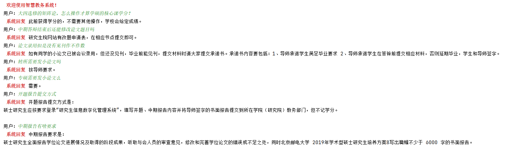

# 基于知识图谱的教务问答系统
本系统开发过程中主要基于知识图谱的规则匹配，将教务系统中的特定事务作为图谱实体节点，将节点所包含的重要内容作为实体节点属性，通过识别实体、查询实体节点对应属性的方式进行问题匹配与回复。

## 环境依赖
neo4j==4.2.2 
javaJDK==15.0.1 
py2neo==2020.1.1 
gensim==3.8.3 
ahocorasick
## 10.09增加语义相似度匹配模块
使用gensim进行word2vec的训练，然后基于余弦相似度计算句子之间的相似度，句子向量等于字符向量求平均
## 运行效果展示

